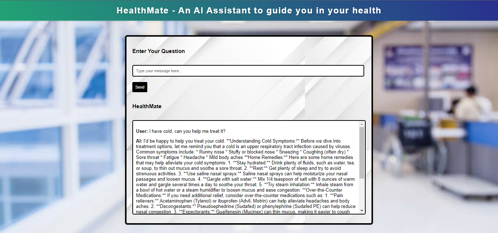

# HealthMate- An AI Assistant to Guide You in Your Health

HealthMate is an AI-powered healthcare guidance assistant designed to help users make informed decisions about their healthcare. The chatbot offers interactive advice and support, using the Gaianet Public Node for data-driven insights to help users shape their healthcare.



## Features

- **User-friendly Interface**: A clean and elegant interface designed for seamless interaction.
- **AI-Powered Guidance**: Provides personalized career advice powered by Gaianet AI.
- **Real-time Feedback**: Instant responses to healthcare queries, helping users navigate their health  effectively.
- **Interactive Design**: A modern, stylish layout to enhance the user experience and make career exploration engaging.

## Technologies Used

- HTML
- CSS
- JavaScript
- Node.js (for backend)
- Gaianet

## Setup and Installation

1. Clone the repository:

   ```bash
   git clone https://github.com/Fushiguro11/HealthMate.git

2. Navigate to the project directory:

    ```bash 
    cd HealthMate

3. Install dependencies:

    ```bash 
    npm install

4. Start the development server:

    ```bash
    node index.js

5. Open your browser and visit:

    ```bash
    http://localhost:3000

## Thankyou
